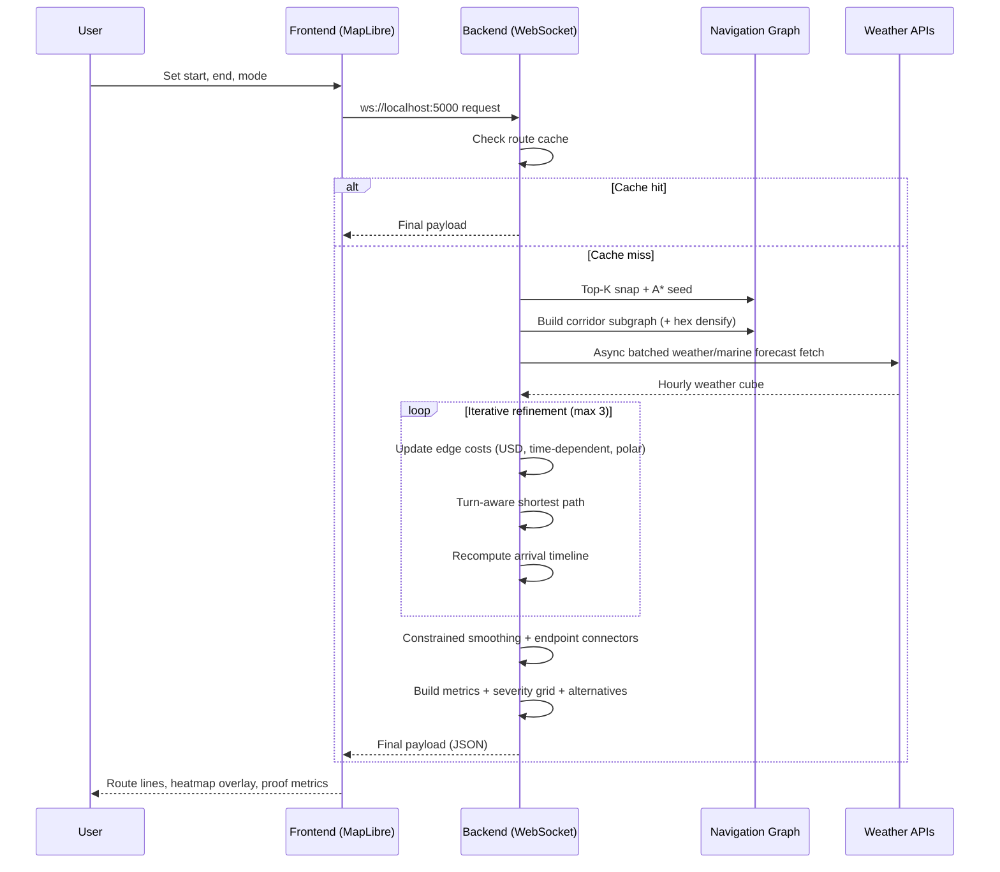

# Ship Voyage Optimization - Interview Flow Diagram

Use this in GitHub, Notion, or Mermaid Live Editor.

## 1) End-to-End System Flow

```mermaid
flowchart LR
    A[User selects Start/End/Mode in Frontend] --> B[Frontend sends WebSocket request]
    B --> C[Backend handle_navigation]

    C --> D[Top-K endpoint snapping<br/>pick best start/end graph nodes]
    D --> E[A* on global graph (seed path)]
    E --> F[Build corridor subgraph around seed]
    F --> G[Optional hex/geodesic lattice densification]

    G --> H[Estimate node arrival hours]
    H --> I[Build/reuse weather cube cache<br/>async rate-limited Open-Meteo fetch]

    I --> J[Iterative optimization loop]
    J --> J1[Interpolate weather along each edge over time]
    J1 --> J2[Compute vessel speed factor from polar<br/>wave height + relative direction]
    J2 --> J3[Compute monetary edge cost (USD):<br/>time + fuel + risk]
    J3 --> J4[Turn-aware shortest path<br/>turn penalty + turn cap]
    J4 --> J

    J --> K[Constrained smoothing<br/>edge-preserving densification]
    K --> L[Attach endpoint connectors<br/>exactly match UI markers]
    L --> M[Build outputs:<br/>optimized path, baseline path,<br/>weather, severity points, severity grid,<br/>wind field, metrics, alternatives]
    M --> N[Send final WebSocket payload]
    N --> O[Frontend renders routes + heatmap + metrics]
```

## 2) Per-Request Runtime Sequence



## 3) Cost Function (Talk Track)

```text
EdgeCost_USD =
  alpha * TimeCost_USD +
  beta  * RiskCost_USD +
  gamma * FuelCost_USD

TimeCost_USD = time_hours * charter_rate_per_hour
FuelCost_USD = fuel_tonnes * fuel_price_per_tonne
RiskCost_USD = edge_risk * distance_nm * risk_cost_per_unit
```

## 4) Interview Pitch (30 sec)

```text
We use A* only to generate a fast corridor seed. Inside that corridor, we run
time-dependent weather-aware optimization with a vessel polar model and convert
all objectives to USD for physically meaningful trade-offs. We also include
turn penalties and turn limits for seamanship realism, then apply constrained
smoothing and marker-to-node connectors for clean UI rendering. The backend is
async with global rate limiting and weather caching to stay near real-time.
```

